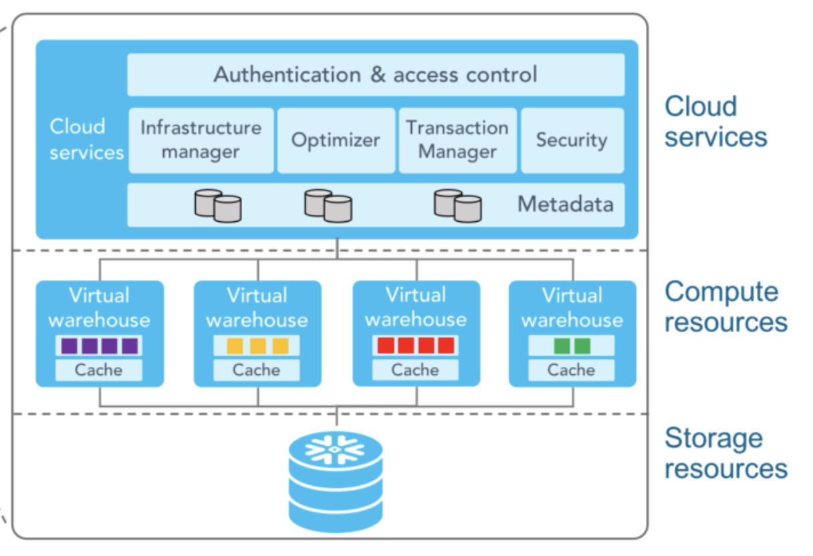
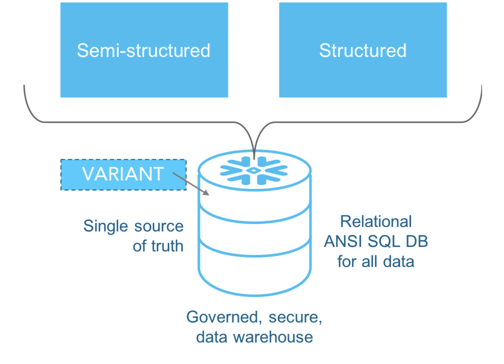

<!-- _class: title -->
<!-- _paginate: false -->
<!-- _header: '' -->
<!-- _footer: '' -->

# Snowflake
## Cloud Data Platform for Swiss SMEs

HEIG-VD IST 2025/26 Markaj Agron · Jorand Yuuta · Stampfli Nathan · Liao Pei-Wen 12.06.2026, 16:30 - 16:42

---

# Agenda

## 01
### Business Scenario
SwissBike SA challenges

## 02
### What is Snowflake?
A quick introduction

## 03
### Architecture
How Snowflake is built

## 04
### Workflow
How data moves through the platform

## 05
### Characteristics
Storage, scalability & recovery

## 06
### Vendor Lock-in
Multi-cloud, but at what cost?

## 07
### Cost Scenario
Real numbers for a Swiss SME

## 08
### Demo
SwissBike SA use case

## 09
### Pros & Cons
Strengths and limitations

## 10
### Recommendation
When should a SME use Snowflake?

---

# Scenario / Challenges

## SwissBike SA

SwissBike SA is a Swiss SME selling bicycles and accessories online:

- **~50 employees**, IT handled by generalists
- **~1,500 orders/month**
- currently **10 analytics users**
- Collect data **across disconnected systems**( E-commerce, ERP, CRM and Marketing tools)

## Challenges

- **No dedicated data engineer**
- Data is scattered across **multiple systems**
- Analytics rely on **manual Excel** exports
- **More users** need access to analytics
- **Growing data volume** with no scalable storage strategy
- **Budget** constraints

### Key Question

How can SwissBike **centralize** its data, **scale** analytics and stay within **budget** **without a dedicated data team** ? 

---

# What Does Snowflake Solve?

| SME Pain Point | Snowflake Solution | Covered In |
|----------------|-------------------|------------|
| User increase | Add Virtual Warehouses without touching storage | Architecture |
| No data engineer | No infra to maintain| Architecture |
| Data volume growing, query speed slower | Storage layer scales independently + Micro-partitions + pruning skip irrelevant data | Architecture + Storage |
| Milti disconnected systems, no single source of truth | Snowpipe centralizes all sources | Workflow + Vendor lockin|
| Manual CSV exports, reports 1 week stale | Automated ingestion, always up to date | Workflow + + Vendor lockin|
| Budget sensitive | Pay only when warehouse is running | Cost Scenario |

 

### Bottom Line

Snowflake is not the cheapest option but for a Swiss SME outgrowing Excel, it **removes the need for a data engineering team entirely**.

---

# Architecture : Independent Scaling & Query Performance

###  Hybrid Model = Shared-disk + Shared-nothing + MPP

## Cloud Services
- Always on, managed by Snowflake (Query opt, metadata, auth)
- **Free** under 10% of daily compute usage

## Compute (Virtual Warehouses)
- 24h query result **cache** &rarr; free repeated queries 
- **Auto scale** up/down, pause when idle
- Trade off : Cold start 2-3s

## Storage
- Decoupled from compute &rarr; pay separately
- Trade off : **Egress costs** when different regions
 

<!--  -->

### Key insight:
Scale independently + Query without conflict, no duplication

### Trade off:
Layer separation adds overhead for small frequent transactions (`INSERT`, `UPDATE` slower than PostgreSQL)

---
# Storage: Columnar, Partitioned & Protected

## Data Types
- **Structured** + **Semi-structured** 
- **Unstructured** → PDF, images via staged storage — limited query support

## Micro-partitions
- Auto-split into **columnar chunks** (50–500MB)
- Metadata per partition &rarr; **pruning skips irrelevant data at query time**
- **Clustering keys** — optional, co-locates frequent query columns for large tables

## Data Protection
- **Time Travel** — query or restore data up to 90 days
- **Fail-safe** — 7-day recovery after Time Travel expires, managed by Snowflake

### Key Advantage
- Mainain query speed as data grow &rarr; prune+cluster 
- Storage cost stays low &rarr; columnar compression

### Trade-off
Egress costs apply when extracting data out &rarr; keep compute and storage in same region

---

# Workflow

*SwissBike SA centralizes data from multiple business systems into Snowflake to generate business insights.*

## Data Sources

- E-commerce platform
- ERP system
- CRM system
- Marketing tools
- CSV / API imports

 

## Data Ingestion

- Batch imports
- Connectors
- External stages
- Semi-structured formats (JSON, Parquet)

## Snowflake Processing

- Centralized storage
- Automatic compression
- Micro-partitioning
- Query optimization
- MPP execution via Virtual Warehouses

 

## Outputs

- SQL analytics
- Dashboards (Power BI, Tableau)
- Reports
- Machine learning datasets

---
# Vendor Lock-in: Multi-cloud, But At What Cost?

## Portable
- Runs on AWS, Azure, GCP : no vendor dependency
- Standard ANSI SQL : queries portable 
- Open ingestion formats — Parquet, JSON, CSV

## Proprietary Features
| Feature | Lock-in Risk | Mitigation |
|---------|-------------|------------|
| Time Travel | no equivalent elsewhere | Use for recovery only |
| Zero-Copy Clone | proprietary syntax | Document dependencies |
| Data Sharing | partner Snowflake account | Export via open formats |
| Snowpipe | proprietary ingestion | Replace with Airbyte or `COPY INTO` |

## Migration Cost If You Leave

- Rebuild all ingestion pipelines
- Recreate security policies & role hierarchy
- Re-implement Time Travel logic elsewhere
- Export all data — **egress costs apply**

### Real Risk for SME
No data engineer :  proprietary features get adopted without governance, migration cost grows silently over time.

### Mitigation Strategy
Prefer ANSI SQL + open formats where possible. Use Snowflake-specific features consciously, not by default.

---
# Cost Scenario: SwissBike SA

## SwissBike Assumptions
- 500 GB stored data
- 1 X-Small Warehouse, Standard edition
- 10h/week warehouse usage
- Region: AWS EU Zurich (**Swiss nDSG**)
- Snowflake CoWork enabled

## How Snowflake Charges

| Layer | Unit | When Charged | EU Zurich |
|-------|------|-------------|-----------|
| Cloud Services | Credits | Free under 10% of compute | ~$0 for SME |
| Compute | Credits/second | Warehouse running only | $3.10/credit |
| Storage | GB/month | Always, 24/7 | $26.95/TB |

## Calculation
`10h/week × 4.3 weeks × 1 credit/h × $3.10 = $133/month`
`0.5 TB × $26.95 = $13.48/month`

| Component | Monthly Cost |
|------------|-------------:|
| Compute (XS Warehouse) | $133.30 |
| Snowflake CoWork | $123.08 |
| Snowflake Cortex AI | $5.78 |
| Storage (500 GB, EU Zurich) | $13.48 |
| **Total** | **$275.64** |

### Cost Observations
- CoWork + Cortex AI = **$128/month — 46% of total bill**
- Storage is cheap, compute dominates
- Without auto-suspend: 24/7 running (40h/week)= ~$520/month instead of $133/month

---

# Demo

---

# Pros & Cons

## Pros

- High scalability
- MPP architecture
- Excellent concurrency
- Minimal administration
- Strong security
- Time Travel & Fail-safe
- Zero-Copy Clone
- Multi-cloud support

## Cons

- Consumption-based pricing
- Cost monitoring required
- Vendor lock-in
- Cloud dependency
- Not optimized for OLTP
- Learning curve

> Snowflake offers strong analytical capabilities and scalability, but requires active cost management and acceptance of some vendor dependency.

---

# Recommendation

## Recommended For

✓ SMEs needing centralized analytics

✓ Companies expecting significant data growth

✓ Organizations with multiple teams accessing data

✓ Businesses seeking low operational overhead

## Not Recommended For

✗ Small transactional applications (OLTP)

✗ Organizations requiring full infrastructure control

✗ Businesses with very limited cloud adoption

### Final Assessment

Snowflake is an excellent analytical platform for growing SMEs.

Its strongest advantages are scalability, MPP processing, concurrency and operational simplicity.

However, organizations should carefully monitor costs and consider the long-term impact of vendor lock-in.

---

# References

- https://www.snowflake.com/en/blog/5-reasons-to-love-snowflakes-architecture-for-your-data-warehouse/
